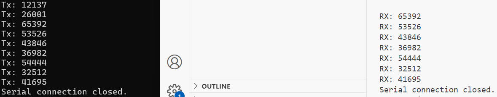

# UART Tx&Rx 16 bits Random Numbers (RNGs) Demo 
This is Transmitter & Receiver of RNGs Demo project via virtual Serial Ports for Digital System Lab. The demo project using UART Transmit (Python) 16 bits RNG DATA from PC(Transmitter) to PC(Receiver). A pair of virtual serial ports was build via "[Free Virtual Serial Ports](https://freevirtualserialports.com/)", which allow one PC support Tx and Rx at the same time.

# Getting Started
1. Download [Free Virtual Serial Ports](https://freevirtualserialports.com/);
2. "Create Local Bridge";
   * First port Name: COM1;
   * Second port Name: COM2;
3. Open one Python IDLE(or the PowerShell) run "uart_rx.py";
4. Open another Pyhton IDLE, run "uart_tx.py";

# Results:

# Prerequisites
Python >= 3.5;
pyserial;  `pip3 install pyserial`
# Reference
Pyserial : https://pyserial.readthedocs.io/en/latest/pyserial.html
# License
This project is licensed under the MIT License